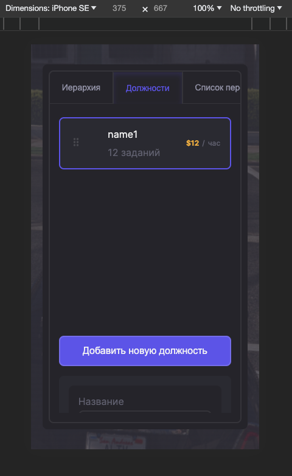
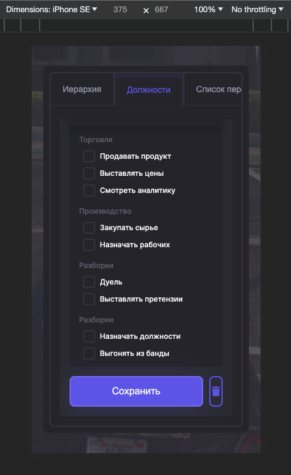
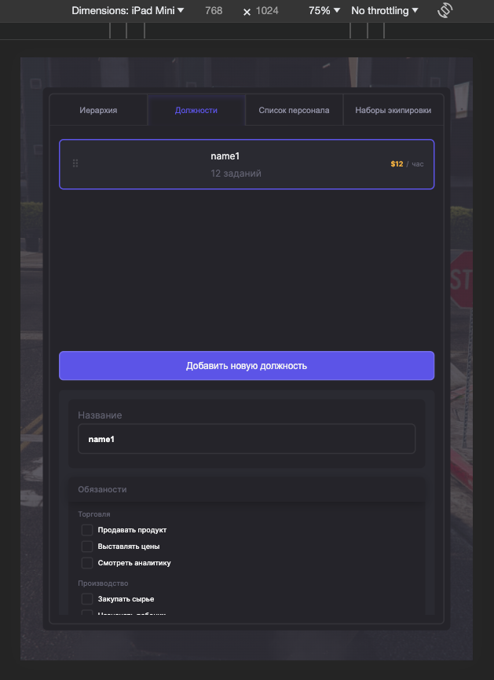
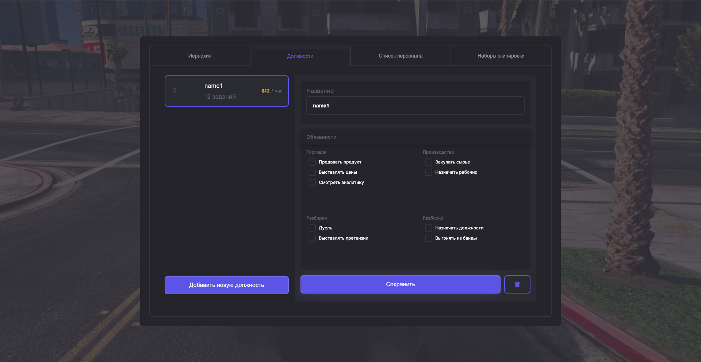
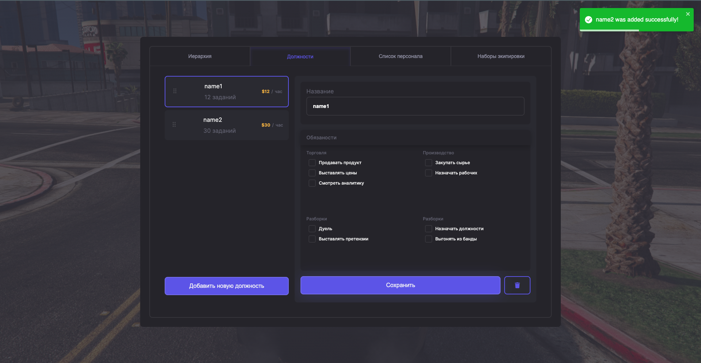
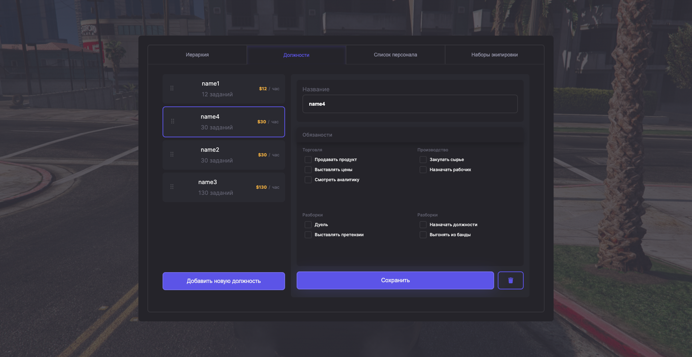
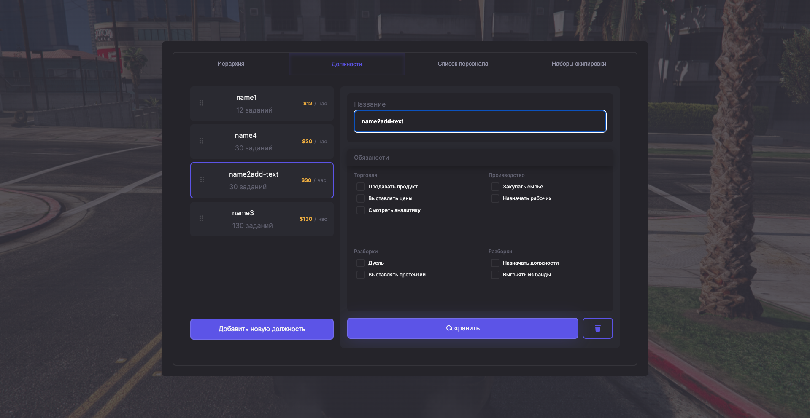
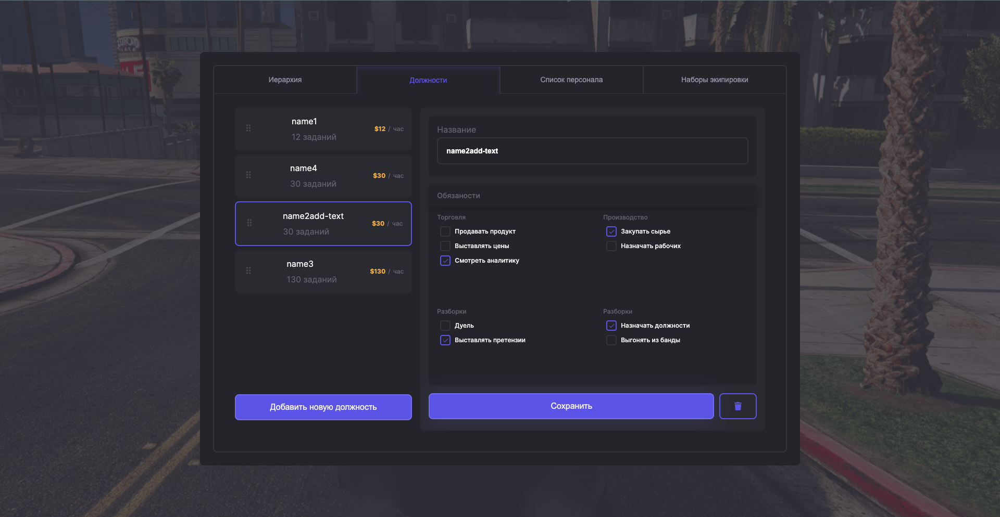
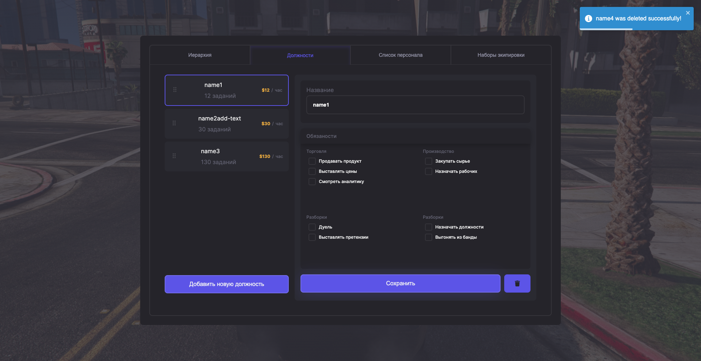

Цей додаток був створений за допомогою [`create-next-app`](https://github.com/vercel/next.js/tree/canary/packages/create-next-app). Головний стек: 
- NextJS
- TypeScript
- Redux Toolkit

## Початок роботи

Клон репозиторія
```
$ git clone https://github.com/bohdan-ryzhko/cogitize-solutions
```
Встановлення залежностей

```
$ npm install
```
Запуск серверу

```bash
npm run dev
```

Відкрийте [http://localhost:3000](http://localhost:3000) у своєму браузері, щоб побачити результат.

## Як працює додаток

Дизайн був розроблений для усіх видів пристроїв:

- mobile

  
  

- tablet

  
  

- desktop

  

При натисканні на кнопку "Додати нову посаду" зʼявляється модальне вікно, в якому знаходиться форма з валідацією (використовував Formik + Yup):
  

Після додавання валідних значень додається нова посада, вся інформація зберігається в локальному сховищі (для цього використовував Redux Persist) і зʼявляється повідомлення (для цього використовував react-toastify)
  

Також було додано функціонал drag and drop
  
  

У вводному полі "Назва" можна динамічно і одразу змінювати імʼя обраного користувача
  

Усі змінені дані, дадані посади та обрані checboxes зберігаються і залишаються тими самими і після перезавантаження сторінки
  

Також є можливість видаляти обрану посаду
  
